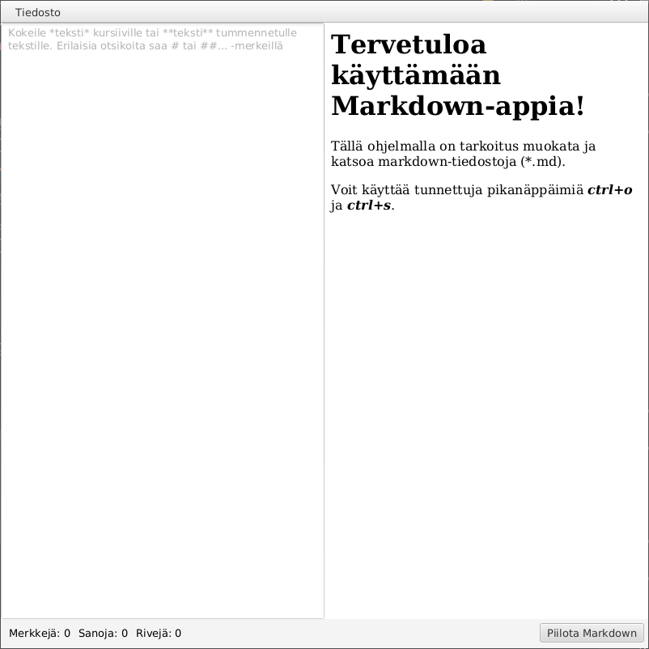
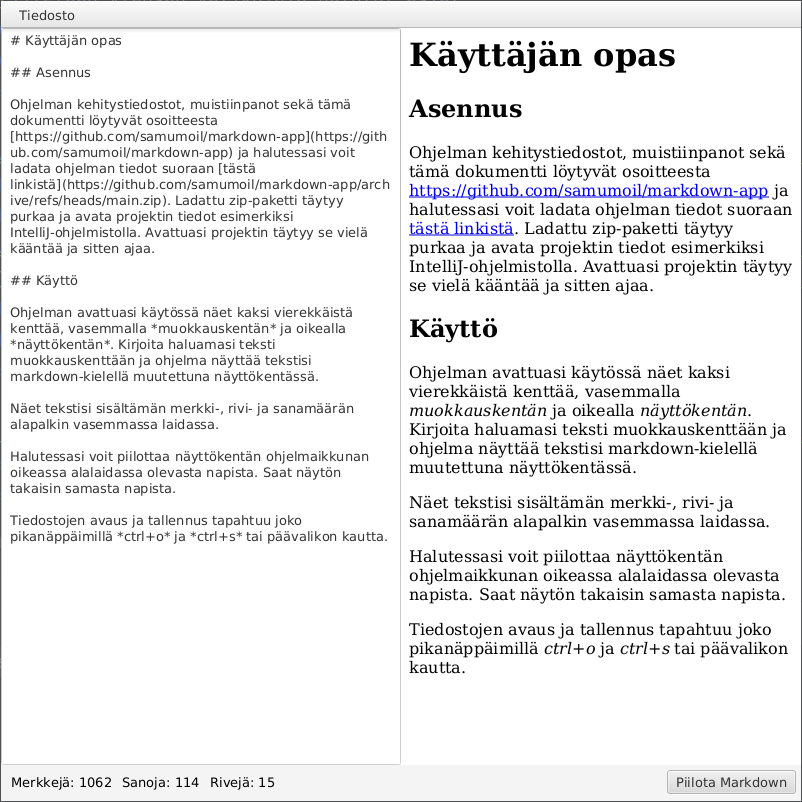

# Markdown-app

A simple markdown viewer and editor.

## Program structure

The class `main` contains the logic of this program and uses the other three main classes: 
- TekstiMarkdown (A class containing the text and the logic for counting words etc)
- TiedostonKasittelija (A class containing static methods for file retrieval and saving)
- KayttoLiittyma (A class containing the JavaFX UI. This class uses a helper class MarkdownParser to parse and render the given text to HTML)

Originally I had plans to include filetypes other than plain text (*.txt and *.md), but due to time constraints that had to be left out. Because of that plan there's an interface `TekstiRajapinta` which was to be used with other filetypes. Also I had plans to separate markdown text and other "basic texts". These basic types were meant to inherit the abstract class `Teksti`. 

Currently there's only one class inheriting `Teksti`, the class `TekstiMarkdown`. This class was meant to containg some automation to find heading information of markdown text.

### UML class diagram

## Project background

This is a project for my computer science course "Programming II". In this course and project we practised using Java and JavaFX. Our focus was in the basics of object oriented programming and UI. 

During the course we learned and practised using these programming principles of Java language:
- objects and inheritance
- attribute and method visibility
- threading
- using files for text and object saving and retrieval
- generic types and linked lists
- javadoc documentation