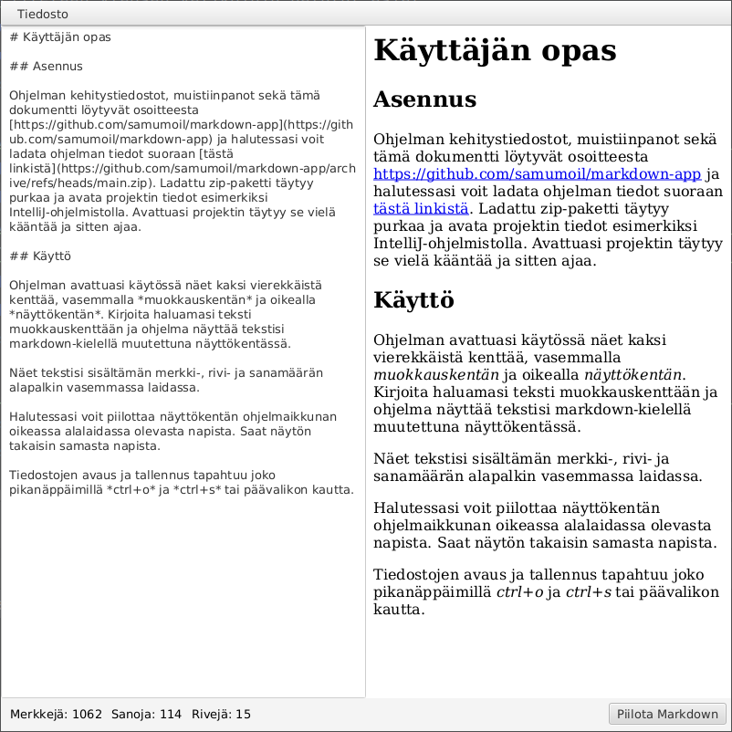

# Markdown-app - Käyttäjän opas

## Asennus

Ohjelman kehitystiedostot, muistiinpanot sekä tämä dokumentti löytyvät osoitteesta [https://github.com/samumoil/markdown-app](https://github.com/samumoil/markdown-app) ja halutessasi voit ladata ohjelman tiedot zip-pakettina suoraan [tästä linkistä](https://github.com/samumoil/markdown-app/archive/refs/heads/main.zip). Ladattu zip-paketti täytyy purkaa ja avata projektin tiedot esimerkiksi IntelliJ-ohjelmistolla. Avattuasi projektin täytyy se vielä kääntää ja sitten ajaa.

## Käyttö

Ohjelman avattuasi näet käytössäsi kaksi vierekkäistä kenttää, vasemmalla *muokkauskentän* ja oikealla *näyttökentän*. Kirjoita haluamasi teksti muokkauskenttään ja ohjelma näyttää tekstisi markdown-kielellä muutettuna näyttökentässä.

Näet tekstisi sisältämän merkki-, rivi- ja sanamäärän alapalkin vasemmassa laidassa.

Halutessasi voit piilottaa näyttökentän ohjelmaikkunan oikeassa alalaidassa olevasta napista. Saat näytön takaisin samasta napista.

Tiedostojen avaus ja tallennus tapahtuu joko pikanäppäimillä *ctrl+o* ja *ctrl+s* tai tiedostovalikon kautta.

### Aloitusnäkymä

### Malliteksti

