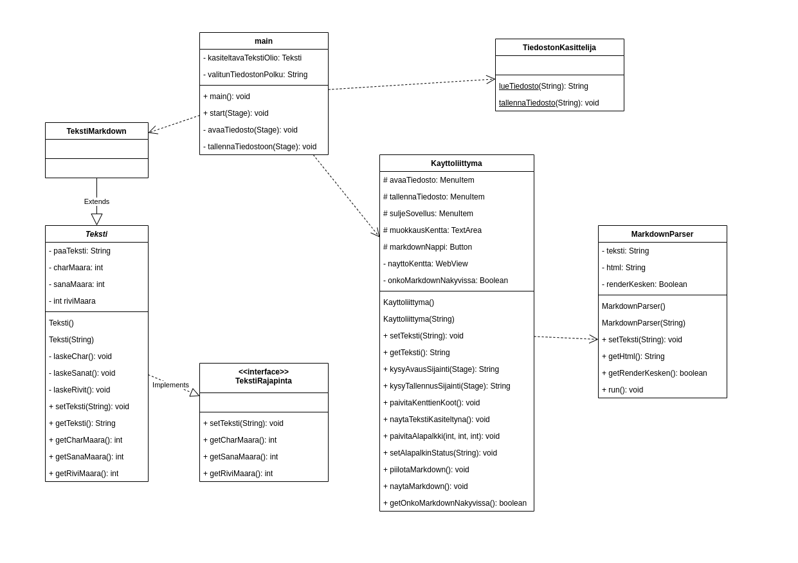

# Kehittämisopas

## Ohjelman rakenne

Ohjelman UML-kaavion näet alla ja siitä huomaat, että ohjelman toiminta jakautuu kolmeen osaan: Teksti-olio, käyttöliittymä (sisältäen markdown-parserin) sekä tiedostonkäsittelijä. Pääohjelma käyttää pääosan kaikesta toimintalogiikasta, lukuunottamatta markdown-parserin käyttöä.

Kirjoitetun tekstin *source-of-truth* on teksti-olion paaTeksti attribuutti, johon kirjoitettu teksti päivitetään jokaisen muutoksen jälkeen, ja joka haetaan tarvittaessa eri toimintoihin. Ohjelman suunnitteluvaiheessa on ajateltu ohjelman olevan laajennettavissa monenlaisiin tekstitiedostoihin, mutta niitä ei ole vielä toteutettu. Tämän vuoksi tekstimarkdown-olio pohjautuu rajapintaan ja abstraktiin luokkaan "teksti".

TekstiMarkdown-luokkaan on tarkoitus toteuttaa erityisesti markdown-tekstiin liittyviä asioita. Näitä voisivat olla tulevaisuudessa esimerkiksi pääotsikoiden rivisijainti, linkkien kerääminen listaan ja ulkoisten kuvien listaaminen. Näitä asioita voisi halutessaan näyttää käyttöliittymällä.

Tekstin renderöinti toteutetaan erillisessä säikeessä, jotta ohjelma toimii sulavasti myös pitkien tekstien kanssa. Tällä hetkellä koodi on toteutettu niin, että pitkän renderöinnin aikana kirjoitettu teksti otetaan käsittelyyn vasta, kun edellinen renderöinti on ohi. Eli välttämättä jokaisen kirjaimen jälkeen ei tapahdu renderöintiä, mutta näin varmistetaan ohjelman sulava käyttö.

Tekstin näyttämiseen markdown-kielellä käytetään projektia nimeltä [commonmark-java](https://github.com/commonmark/commonmark-java). Projekti tuodaan ohjelmaan moduulina.

### UML-kaavio

Kaaviossa näkyvät kaikki ohjelman toiminnan kannalta olennaiset attribuutit ja metodit.

### Javadoc

Ohjelman javadoc-dokumentaatio löytyy osoitteesta [https://github.com/samumoil/markdown-app/tree/main/javadoc](https://github.com/samumoil/markdown-app/tree/main/javadoc).

## Kehityskohteet

Ohjelmassa on kaksi selkeää kehityskohdetta: ulkoasu ja erilaisten tiedostomuotojen tukeminen.

Ulkoasua voisi hioa ainakin lisäämällä "darkmode" ja käyttämällä yhtenäisiä fontteja. Aiemmin mainittuja ajatuksia markdown-tekstiluokan ominaisuuksista, voisi hyödyntää tekemällä näkymän oikeaan laitaan listan tekstin otsikkotasoista. Tähän voisi hyvin käyttää javan rakennetta ArrayList<String> ja näyttää otsikkotasot ListView-näkymässä. Otsikkoa painamalla näkymä hyppäisi kyseisen otsikon kohdalle.

Tiedostomuotojen lukemiseen ja tiedostopäätteen perusteella tapahtuvaan toiminnanohjaamiseen voisi paneutua jatkokehityksessä. Tällä hetkellä rajapinnan ja erilaisten teksti-luokkien käyttö on vasta suunnitteluasteella.
